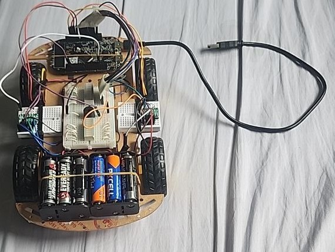

# CG2271-Project
## Overview
CG2271 is the module code for "Real Time Operating Systems" (RTOS for short). The project for this module aims to design a miniature robotic car controlled wirelessly using a PS5 controller + Bluetooth and then use the controller to move the car in order to clear an obstacle course consisting of ramps and plastic cones while change LED lighting patterns and play music simultaneously. A group of 4 to 5 students are tasked to work together to complete the requirements stated above.

## Project Specifications
### Functionality
#### Motor Control
1. The robot must be able to move in all four directions, Forward, Left, Right and Back.
2. The robot must be able to perform curved turns while moving.
3. The robot must stop all movement if no command is being sent.

#### LED Control
1. The front 8-10 Green LED’s must be in a Running Mode (1 LED at a time) whenever the robot is moving (in any direction).
2. The front 8-10 Green LED’s must all be lighted up continuously whenever the robot is stationery.
3. The rear 8-10 Red LED’s must be flashing continuously at a rate of 500ms ON, 500ms OFF, while the robot is moving (in any direction).
4. The rear 8-10 Red LED’s must be flashing continuously at a rate of 250ms ON, 250ms OFF, while the robot is stationery.

#### Audio Control
1. The robot continuously uses its buzzer to play the song "Mary had a little lamb" from the start of the challenge run till the end. There should not be any break in the song even if the robot is not moving.
2. When the robot completes the challenge run, the robot must play a unique tone to end the timing.

### Constraints
#### Hardware
1. 30cm Male to Male Jumper DuPont Wire
2. Breadboard
3. 1x Chassis Board
4. 4x Wheels
5. Header pins
6. 2x DRV8833 Dual Motor Driver Carrier
7. 1x FRDM-KL25Z microcontroller
8. 1x 10 Segment LED Bar Graph - Green
9. 1x 10 Segment LED Bar Graph - Red
10. 1x PS5 Controller
11. 1x ESP-32 WIFI+Bluetooth Development Board
12. 1x Buzzer
13. AA Batteries

#### Software
The robot is required to execute the functionalities concurrently, therefore operating systems constructs must be employed to achieve concurrency.
##### IDE
1. Arduino
2. Keil Microvision 5
##### Programming Language
1. C

##### Main Libraries used
1. [Bluepad32](https://github.com/ricardoquesada/bluepad32) (to allow communication between PS5 controller and the ESP-32 module)
2. [CMSIS RTOS-2](https://arm-software.github.io/CMSIS_6/latest/RTOS2/index.html) (to use real-time operating system constructs such as threads, semaphores, mutexes etc. needed for the robot to execute tasks concurrently)

## My role in the project
I was responsible for implementing motor control, as well as ensuring that the robot can execute tasks concurrently. In the process, I have picked up debugging skills in both hardware and software. On the hardware side, I used an oscilloscope to debug the PWM signals sent to the motor drivers to ensure correct signal transmission across the jumper wires. 

On the software side, I made use of the debugging feature included in KL25Z board, OpenSDA together with the Keil IDE to debug issues relating to logical errors present in motor controls and read the CMSIS-RTOS2 documentation to implement task concurrency.

I also coordinated with my other teammates to assemble the chassis from the parts given, discuss which pins on the KL25Z are to be used, which parts need to be soldered as well as the overall layout of all the modules on the chassis. 

I worked closely with my groupmate who was responsible for establishing Bluetooth connection between the ESP32 and the PS5 controller to figure out how the curved turns can be implemented, the type of curved turns possible using the PS5 controller as the interface, and the curved turns needed to clear the obstacle course.

## End product

A video demonstrating the robot's capabilities can be found [here]()

